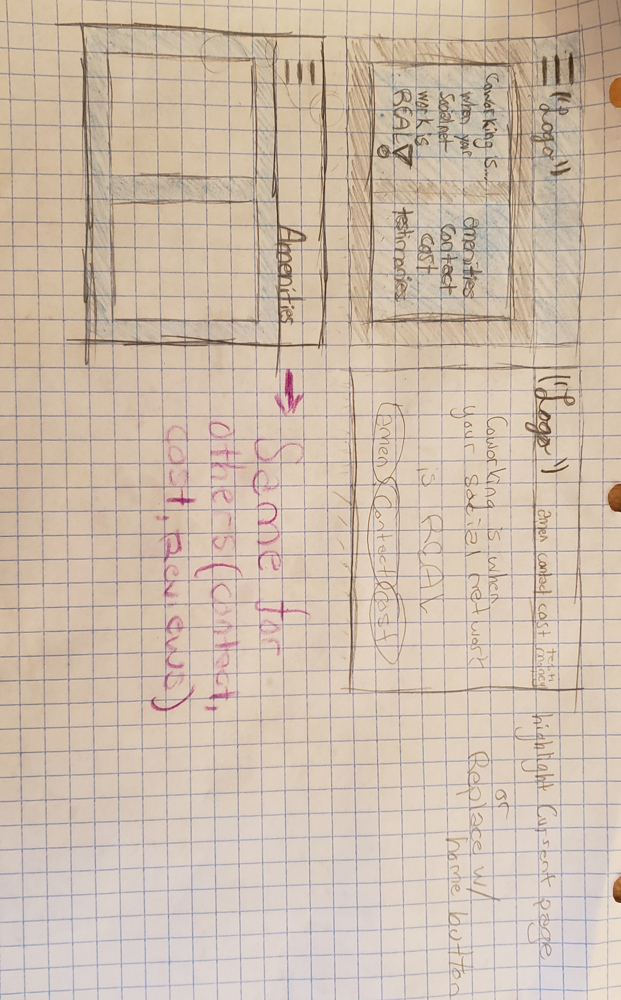
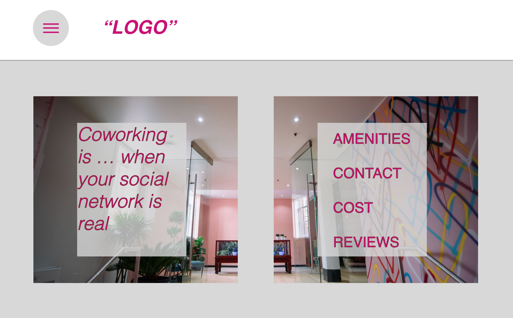

## Pillbug Co-work Space
#### Created by Isaac Hall
---

#### Last Updated - 2/22/2019

### Client Request

* "Online presence mirrors real-life space"

* "Luxurious, cool, and high-end; yet still 100% welcoming and inclusive to everyone"

* "We think we're more funky, more local, less corporate, and a little more fun."

* Appeal to:
  * Artists
  * Day Traders
  * Craftsman
  * Authors
  * Counselors
  * Traditional Businessman
  * Tech-Heads

* Amenities:
  * Coffee-counter
  * Diversity in workspace (private and communal)
  * Fast Internet
  * Fax/Printer
  * Thursday Events (e.g., yoga, food, beer, crafts, speakers)

* MVP:
  * Landing page
  * Contact page
  * Amenities
  * Subscription/Membership Costs/How to Join

### Images

Screenshots of your Sketch wireframes should go here. Make sure to include all versions (if you have different mobile, tablet, desktop, etc.) designs. Use Dropbox or another free image hosting service to host your images.

#### Paper Sketch

Grid Paper Sketch 

#### Wireframes

First Draft 

First Minimal Design 

Color Scheme changing 

Fleshed out! Incorporates Pill design 

### Personas

**Target Users:**

* Betsy, the future employee - My goal is to get a job at a company that knows how to have fun in addition to the everyday work. I will use this site to find signs of a friendly and exciting workspace atmosphere with a greater focus on collaboration and welbeing than on making money . My primary pain point is websites that take themselves too seriously.

* Billy, the retired guy looking to spice up his life - I intend to use a site to help bring excitement back into my dull life. Since my cat, Gretchen, passed away 4 years ago, i've been in a constant state of anxiety. I hate it when websites make me think of my last cat, but love it when the design is sleek enough for me to be distracted effortlessly.

* Bobby, the friend of a friend- My goal is to find a company that can help develop a website for my business which specializes in cat fur. I will use this site to make sure that my cat fur is conflict free and organic. My primary pain point is websites that I can not relate to.

* Belly, the investor - My goal is to invest in a unique and cutting edge company that will generate a passive income for myself so I can spend more time in France! I only invest in the finest of ideas such as HotDogCozies&trade;. I will use this site to learn more about a place I can go to express myself and my grandiose ideas. My primary pain point is websites that aren't the creme de la cream(Did I mention I went to franc Benny, potential employee - My goal is to work at a company. I will use this site or any other site as long as i'm getting paid. My primary pain point is when it takes extra long for my welfare checks to clear.

### User Stories

* As a freelancer looking for a job with this company, I would love to see the culture accurately represented by the website.
* As a politician, I want the website to prove this company can be efficient, inclusive & safe for everyone in our community.
* As an investor, I want to see that the business is something that takes itself seriously enough for me to take it serious as well. Also, what makes this company stand out in an already saturated market?
* As a interested Marketer, I would like to see that the business' day-to-day operations incorporate those from different walks of life such as artists, writers, creatives, & craftspeople from other industries.
* As a future employee, I want the work-life to not be boring!

#
### Responsiveness

The goal is to create a pillbug rolling effect of the content as the page is minimized.

### Setup Instructions

Describe how someone can clone and launch this project.

### Roadmap

Is there work you plan on continuing doing on this project? Features you'd like to add?

* Consider
* Listing
* Them
* Here

### License
This project is licensed under the MIT license, Copyright (c) 2019 [Isaac Hall](/LICENSE.md)

For more information see LICENSE.md.
