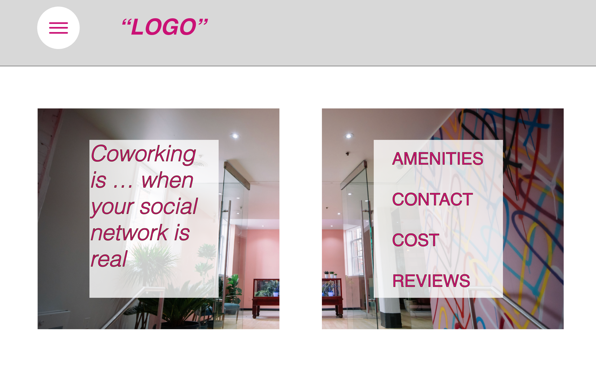
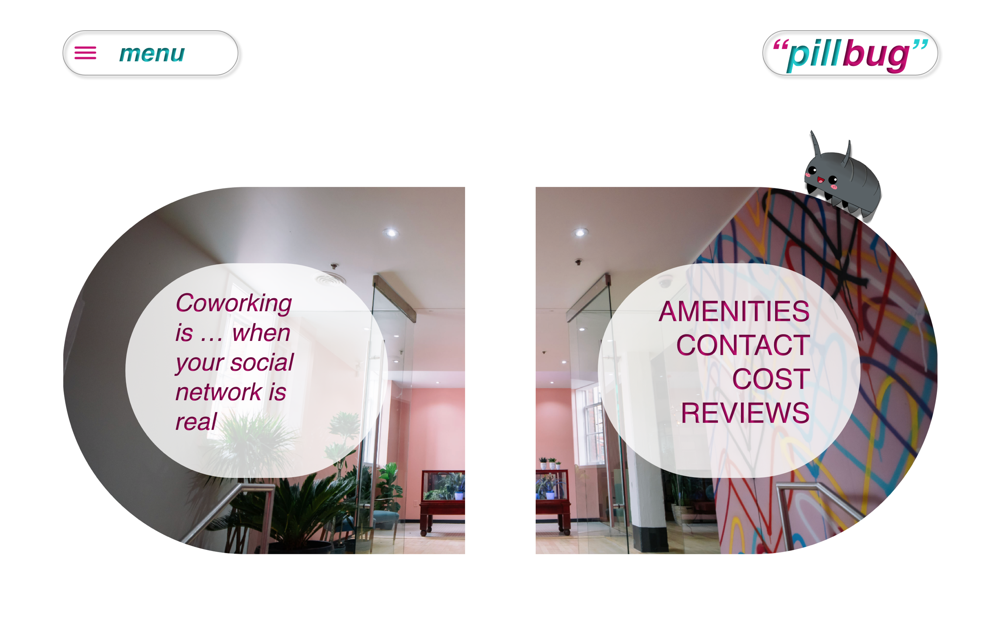

## Pillbug Co-work Space
#### Created by Isaac Hall
---

#### Last Updated - 2/22/2019

### Client Request

* "Online presence mirrors real-life space"

* "Luxurious, cool, and high-end; yet still 100% welcoming and inclusive to everyone"

* "We think we're more funky, more local, less corporate, and a little more fun."

* Appeal to:
  * Artists
  * Day Traders
  * Craftsman
  * Authors
  * Counselors
  * Traditional Businessman
  * Tech-Heads

* Amenities:
  * Coffee-counter
  * Diversity in workspace (private and communal)
  * Fast Internet
  * Fax/Printer
  * Thursday Events (e.g., yoga, food, beer, crafts, speakers)

* MVP:
  * Landing page
  * Contact page
  * Amenities
  * Subscription/Membership Costs/How to Join

### Images

Screenshots of your Sketch wireframes should go here. Make sure to include all versions (if you have different mobile, tablet, desktop, etc.) designs. Use Dropbox or another free image hosting service to host your images.

#### Paper Sketch

Grid Paper Sketch

#### Wireframes

First Draft

First Minimal Design

Color Scheme changing

Fleshed out! Incorporates Pill design

### User Stories

* We'll  
* Learn
* About
* These
* Monday
* Night

### Technologies and Resources

* List
* What
* Outside
* Technologies
* You've
* Used
* Here

### Responsiveness

Describe how the site is responsive, and what different 'versions' this project includes (does it have a mobile version? tablet version? )

### Setup Instructions

Describe how someone can clone and launch this project.

### Roadmap

Is there work you plan on continuing doing on this project? Features you'd like to add?

* Consider
* Listing
* Them
* Here

### License

MIT.

Copyright (c) 2019 **_{ Isaac Hall }_**
